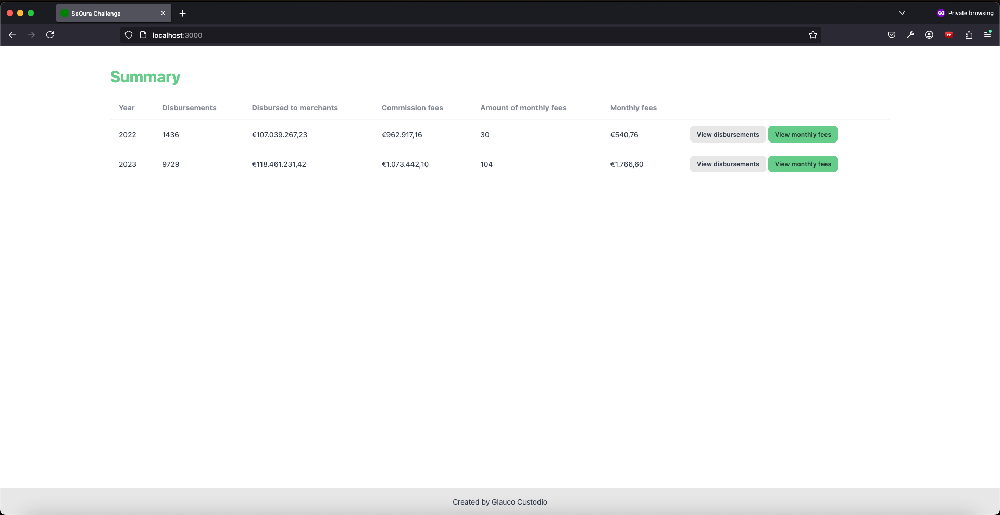
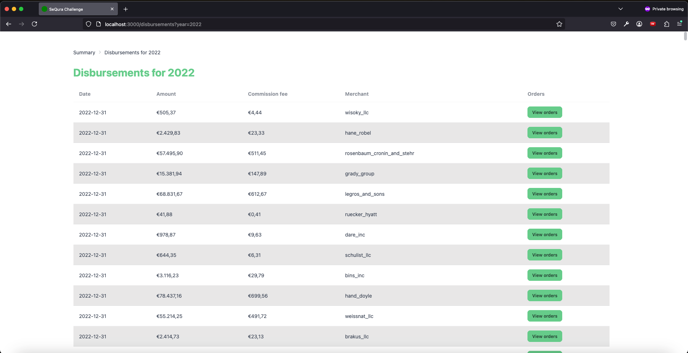
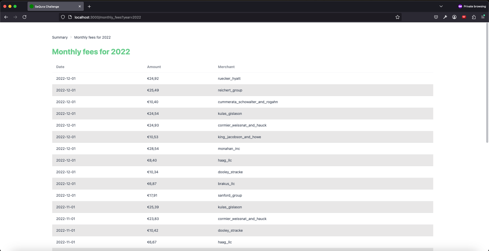

# SeQura Challenge

Application responsible for calculating merchant disbursements. The challenge is described [here](https://sequra.github.io/backend-challenge/).

## Output

| Year | Disbursements | Disbursed to merchants | Commission fees | Amount of monthly fees | Monthly fees |
|------|---------------|------------------------|-----------------|------------------------|--------------|
| 2022 | 1436 | €107.039.267,23 | €962.917,16 | 30 |  	€540,76 |
| 2023 | 9729 | €118.461.231,42 | €1.073.442,10 | 104 | €1.766,60 |


## Showcase

🎬 A video demo is available in the folder `showcase/video.mov`.


> screenshot of the yearly summary page


> screenshot of the disbursement page


> screenshot of the orders page


> screenshot of the monthly fee page

## Tech notes

The solution was built with the latest version of Ruby on Rails (`rails new` has used my [.railsrc file](https://github.com/glaucocustodio/dotfiles/blob/master/config/.railsrc))

Most of the logic is defined in the folders:

- `app/domains`
- `app/models`

Monetary values are stored and processed in cents (as integers in the database) to avoid float precision issues. The gem [money-rails](https://github.com/RubyMoney/money-rails) is used to help with conversions.

The default currency of the application is EUR (as per `config/initializers/money.rb`), all monetary values coming from csv files are considered to be in that currency as well.

[Shale](https://github.com/kgiszczak/shale) is used to map attributes of the csv files.

[RSpec](https://github.com/rspec/rspec-rails) is the test framework and [FactoryBot](https://github.com/thoughtbot/factory_bot) is used for test data.

Tests follow best practices defined in [Even Better Specs](https://evenbetterspecs.github.io/).

[standard](https://github.com/standardrb/standard) is used to lint/format the code.

### Import process

`db/seeds.rb` imports all merchants and orders from the files `db/seeds/merchants.csv` and `db/seeds/orders.csv` respectively.

The importer classes expect a file path as input, so the application could easily be extended to allow users uploading files for their computers or from urls for example.

Invalid and duplicate records are ignored. You can try importing the same file twice, nothing will be imported in the second attempt since [insert_all](https://apidock.com/rails/v6.0.0/ActiveRecord/Persistence/ClassMethods/insert_all) is used.

The seeds file also processes all disbursements and monthly fees.

The system is prepared to process new merchants and orders, one just need to change the csv files and run again `bundle exec rails db:seed`, it'll only insert/process new data.

`bundle exec rails db:seed` takes typically ~ 2 minutes and 30 seconds on my MacBook Pro M1.

### Recurring jobs

[Solid Queue](https://github.com/rails/solid_queue) is used to process background jobs. This is my first time using this backend, I've mostly used [Sidekiq](https://sidekiq.org/) in real world applications.

There are two recurring jobs set at `config/recurring.yml`:

- disbursement_job: process merchant disbursements daily at 8AM
- monthly_fee_job: calculate monthly fees at the start of each month (first day at 1AM - [0 1 1 * *](https://crontab.guru/#0_1_1_*_*))

### User interface

There is a simple user interface built with [daisyUI](https://daisyui.com/docs/intro/). It displays the yearly summary, disbursements (their orders) and monthly fees.

Just run the server and visit [http://localhost:3000/](http://localhost:3000/) in the browser.

### Continuous integration (CI)

The project has continuous integration (CI) set up that among other things run the tests on every commit to branch main.

Check `.github/workflows/ci.yml` for more details.

### AI

The solution has been developed using the editor [Cursor](https://www.cursor.com/), the file `.cursorrules` is used to provide some instructions (although it's gonna be [deprecated](https://docs.cursor.com/context/rules#cursorrules-legacy) soon).

[ChatGPT](https://chatgpt.com/) has also been used to provide some guidance / troubleshooting.

## Setup

### Dependencies

Ensure your system has installed ([asdf](https://asdf-vm.com/guide/introduction.html) is recommended to manage versions):

- Ruby (3.3.4 as per `.ruby-version`)
- Postgres (version 16+)

### Installation

Install gems:

```shell
bundle
```

Prepare the database:

```shell
bin/rails db:create db:migrate
```

Example data can be generated by running seeds:

```shell
bin/rails db:seed
```

### Running

To run rails server along with Solid Queue workers in dev env:

```shell
make run
```

### Tests

To run the tests:

```shell
make test
```

### Formatting

To check for lint/formatting issues:

```shell
make lint
```

To automatically fix the ones that can be fixed:

```shell
make lint_fix
```
